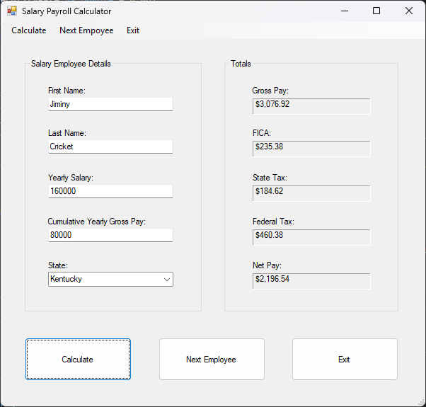
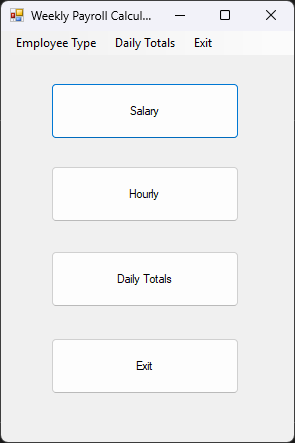

# Payroll Calculator App

## Overview
This project is a payroll calculator app meant for a payroll employee.  It takes as input the workers' hours, wages, state, as well as their cumulative earnings this year, and returns Gross Pay, FICA (Social Security + Medicaid), State Tax, Federal Tax, and Net Pay.  It adds to a running total that can display the daily total Gross Pay and Net Pay for salaried and hourly employees respectively.

## Technology
VB.NET, Visual Studio .NET forms

## How to Run
First, make sure you have Visual Studio installed with the .NET forms framework.

Then, download the payroll-app project folder.
 
 Open the folder and double-click on the .sln file to open it in Visual Studio.  Allow for any updates if necessary.
 
 Here you can view the code as well as run the program.

To run the program, click the green start button in the top navigation bar.

## Using the Program
Upon opening the program, the main page will appear.

Select if the employee is hourly or salaried.

In the next page, enter the information for each employee and press calculate.  A running daily total will accumulate for all Gross and Net pay.

You can press exit to return to the main page and navigate through the program as much as you like.  At any point you can press the Daily Totals button to see the total Gross and Net pay for the day.

## Design
payroll-app-design.docx contains the design for the logic as well as the test cases.

payroll-app-structure-chart.vsdx is a VISIO file showing how all the functions and procedures pass data to each other.

## Takeaways
This project was a culmination of learning the Single Responsibility Principle of organizing code into modules, validating input, private vs public functions and procedures, passing data by reference vs by value, scope, data types, and how to design and document a program.